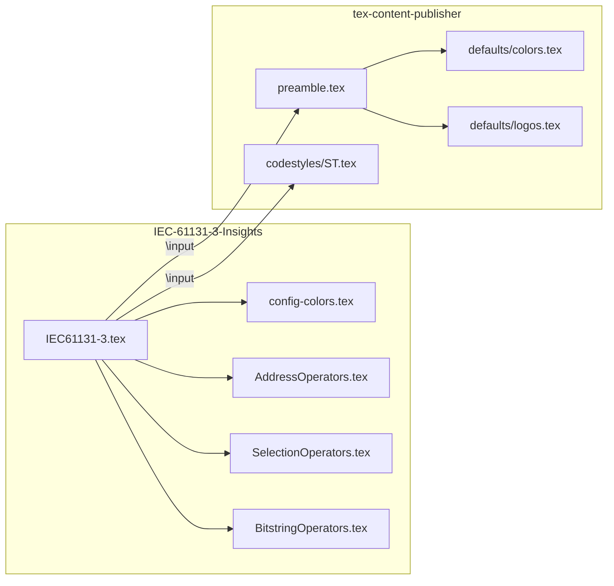
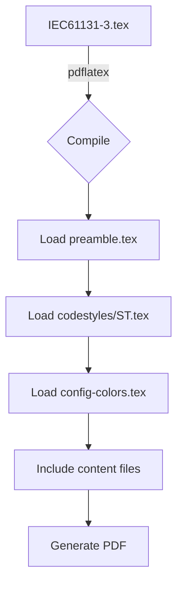

# IEC-61131-3-Insights

If you want to learn about the IEC 61131-3 standard, discover best practices, helpful guides, and resources to improve your skills in industrial automation, follow us! We share clear and practical content to help you master the languages and methodologies defined by this standard.

## Project Structure

```
IEC-61131-3-Insights/
├── PDF_Notes/
│   └── File Tex/
│       ├── IEC61131-3.tex      # Main document
│       ├── AddressOperators.tex
│       ├── SelectionOperators.tex
│       ├── BitstringOperators.tex
│       ├── config-colors.tex   # Local color overrides
│       └── img/                # Logos and images
├── Programming/
└── README.md
```

## Template Architecture

This project uses [tex-content-publisher](https://github.com/asdcainicela/tex-content-publisher) as an external template.



## Compilation Flow



## Prerequisites

1. **MiKTeX** (Windows) - LaTeX distribution
2. **tex-content-publisher** template as sibling folder:

```bash
# Option 1: Git submodule (recommended)
git submodule add https://github.com/asdcainicela/tex-content-publisher.git ../tex-content-publisher

# Option 2: Clone manually
git clone https://github.com/asdcainicela/tex-content-publisher.git ../tex-content-publisher
```

## How to Compile

```bash
cd PDF_Notes/File\ Tex
pdflatex IEC61131-3.tex
```

Or use **VS Code** with **LaTeX Workshop** extension - just press `Ctrl+S` to compile.

## Codesys Version

Codesys 3.5.18.30